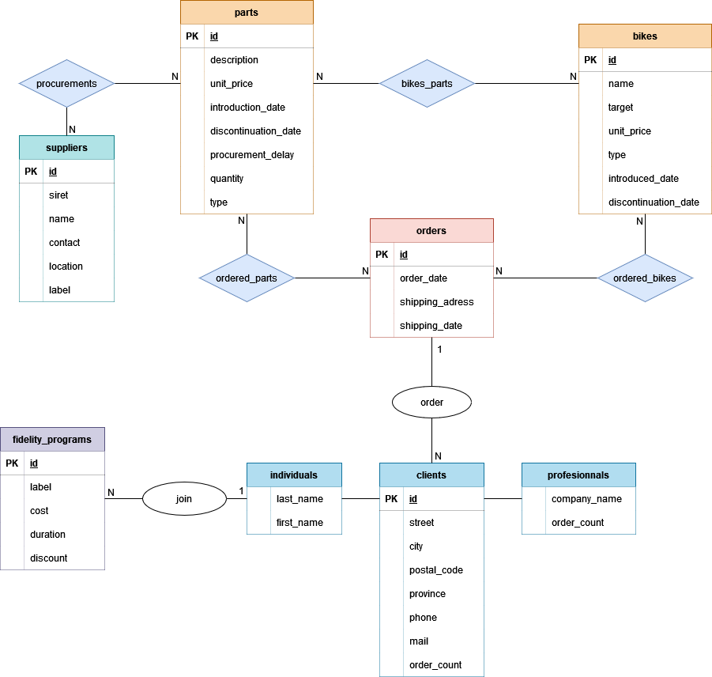

# Rapport BDD A3 - 2022

_Iman TOURRES, Victor TARROUX, Tom XIE_

## Prévisualisation

## Technologie

### Avalonia

Les trois membres étant sur Linux, WPF n'était pas envisageable car pas disponible sur Linux, on a donc utilisé une dérivé qui est **Avalonia**

## Problèmes rencontrés

### Langage

On a pas eu beaucoup de cours de C# car nous 3 on a pris le module C/C++ pendant le 1er semestre, donc on a vu le C# que pendant le module de Complément de formation.

### Documentation

La documentation sur Avalonia étant limité, c'était frustrant de tout comprendre pour réussir à faire ce qu'on voulait.

### Temps

Avec la contrainte du temps et de la superposition de plusieurs autres projets, on a eu peu de temps pour réaliser ce projet.

## Partie technique

### MVVM Patron de conception


On a utilisé une dérivée du patron de conception **MVC** (model-view-controller) pour implémenter notre application, la plupart des projets WPF implémentent le MVVM (model-view-viewmodel), on a donc décidé de suivre ainsi cette structure pour organiser les fichiers.

### SQL

#### Modèle MCD



1. ***Connaitre la piece la plus vendu, le benefice induit par cette piece et la quantitée moyenne vendu par commandes de cette piece***

```mysql
SELECT P.description , sum(OP.quantity), sum(OP.quantity)*P.unit_price, avg(OP.Quantity) FROM ordered_parts OP JOIN parts P ON OP.parts_id=P.id 
JOIN orders O ON OP.orders_id = O.id 
WHERE O.shipping_date>'" + year + "-" + mois + "-01' 
GROUP BY P.id 
HAVING sum(OP.quantity)>= all(SELECT sum(quantity) FROM ordered_parts GROUP BY parts_id);
```

2. ***Pouvoir acceder a toutes le pieces en fonction du `string` mis dans la fonction csharp***

```mysql
SELECT B.string, P.description, P.Quantity 
FROM bikes B JOIN bike_parts Br ON B.id=Br.bikes_id 
JOIN parts P ON P.id=Br.parts_id 
ORDER BY B.string;
```

3. ***Pouvoir avoir le prix moyen d'une commande, la quantité moyenne de pieces vendus ainsi que la quantité moyenne de velos vendus***

```mysql
Select avg(Bp.quantity*B.unit_price + Pp.quantity * P.unit_price), avg(Bp quantity), avg(Pp.quantity) 
From orders O JOIN ordered_bikes Bp ON O.id=Bp.orders_id 
Join bikes B on B.id = Bp.bikes_id 
join ordered_parts Pp on Pp.orders_id = O.id 
join parts P on P.id = Pp.parts_id;
```
                                                
                    
